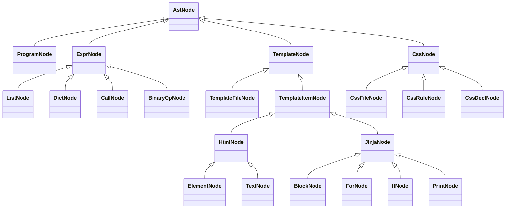

# تقرير مشروع المترجمات

## 1. معلومات المشروع

- اسم المشروع: Flask-Jinja2-Compiler
- الفرع: S2
- المستودع: https://github.com/AliAsaad715/Flask-Jinja2-Compiler
- الهدف: بناء مترجم مصغر يحلل تطبيق Flask يستخدم Python وJinja2 وHTML وCSS، ثم ينتج موقع HTML ثابتاً لا يحتوي على شيفرة Jinja.

الموقع النهائي لا يحتاج إلى Flask عند فتحه. يستخدم Flask وJinja2 كلغتي إدخال للمترجم، بينما يحول المولد القوالب والبيانات إلى صفحات HTML جاهزة للمتصفح.

## 2. بنية المشروع

- `src/antlr`: قواعد ANTLR وملفات Lexer وParser.
- `src/AST`: عقد شجرة Python.
- `src/AST/template`: عقد Jinja2 وHTML.
- `src/AST/template/expr`: عقد تعابير Jinja2.
- `src/AST/css`: عقد CSS.
- `src/Visitor`: زوار بناء الأشجار وجمع الرموز.
- `src/Symbol`: جداول الرموز والنطاقات.
- `src/Analysis`: الربط، استخراج البيانات، والأخطاء النحوية والدلالية.
- `src/Generator`: توليد الموقع الثابت والتحقق من الخرج.
- `src/app/Main.java`: خط تشغيل مراحل المترجم.
- `Tests`: ملفات Python والقوالب وCSS المستخدمة كمدخل صحيح.
- `Tests/semantic`: مدخلات تحتوي أخطاء دلالية مقصودة.
- `Tests/syntax`: مدخل يحتوي خطأ نحوياً مقصوداً.
- `generated/static_site`: الموقع الثابت الناتج.

## 3. Lexer وParser

توجد قواعد مستقلة لكل لغة:

### Python

- `src/antlr/PythonLexer.g4`
- `src/antlr/PythonParser.g4`

تدعم القواعد الاستيراد، الإسناد، القوائم، القواميس، الدوال، decorators، routes، الشروط، return، الاستدعاءات، الخصائص، والفهرسة.

### Jinja2 وHTML

- `src/antlr/TemplateLexer.g4`
- `src/antlr/TemplateParser.g4`

تدعم القواعد عناصر HTML وattributes، بالإضافة إلى `extends` و`block` و`for` و`if` و`with` وتعابير الطباعة.

### CSS

- `src/antlr/CssLexer.g4`
- `src/antlr/CssParser.g4`

تدعم القواعد selectors وdeclarations والقيم الرقمية والنصية والألوان والدوال البسيطة.

تجمع `SyntaxErrorCollector` أخطاء Lexer وParser. إذا ظهر أي خطأ نحوي يتوقف التوليد، فلا ينتج المترجم موقعاً من مدخل غير صحيح.

## 4. أشجار AST

يبني المشروع ثلاث أشجار:

1. Python AST عبر `FlaskJinja2Visitor`.
2. Jinja2/HTML AST عبر `TemplateAstBuilder`.
3. CSS AST عبر `CssAstBuilder`.

جميع العقد ترث من `AstNode`. تخزن العقدة اسمها ورقم السطر وأبناءها، وتخصص `describe()` أو `details()` حسب نوعها. يحقق ذلك الوراثة وتعدد الأشكال، بينما تطبع `pretty()` العقدة وأبناءها بصورة شجرية.



## 5. جداول الرموز

يبني `SymbolTablePython` جدول Python ويسجل:

- imports
- variables
- functions
- parameters
- scopes

ويبني `TemplateSymbolCollector` جدول القوالب ويسجل:

- متغيرات context القادمة من Python.
- متغيرات حلقات `for`.
- متغيرات `with`.
- نطاقات blocks والشروط والحلقات.

تُطبع الجداول ضمن الخرج النصي عند كل تشغيل.

## 6. تمرير البيانات من Python إلى Jinja2

ينفذ المشروع الربط على مرحلتين:

1. يبحث `PythonTemplateBinder` عن استدعاءات `render_template` ويربط اسم القالب بالـroute والمتغيرات الممررة إليه.
2. يستخرج `PythonDataSourceExtractor` بنية مصفوفة `products` وأسماء حقولها وأنواعها.

مثال تدفق البيانات:

```text
products.html <- products=products
product_detail.html <- product=product
delete_product.html <- product=product
```

عند التوليد يستخرج `PythonValueExtractor` القيم الفعلية من Python AST. لا يقرأ المولد نص Python مباشرة ولا ينسخ القوالب؛ بل يتعامل مع العقد والقيم الناتجة من مرحلة التحليل.

## 7. التحليل الدلالي

ينفذ التحليل في `FlaskSemanticAnalyzer` و`TemplateSemanticAnalyzer`. من الأخطاء المعالجة:

1. `DUPLICATE_ROUTE`
2. `ROUTE_PARAM_MISSING`
3. `FUNCTION_PARAM_NOT_IN_ROUTE`
4. `TEMPLATE_NOT_FOUND`
5. `DUPLICATE_TEMPLATE_CONTEXT`
6. `UNDEFINED_PYTHON_NAME`
7. `EXTENDS_TEMPLATE_NOT_FOUND`
8. `UNDEFINED_TEMPLATE_NAME`
9. `URL_FOR_UNKNOWN_ENDPOINT`
10. `DUPLICATE_TEMPLATE_BLOCK`
11. `UNKNOWN_DATA_FIELD`

ينتج الاختبار الخاطئ الحالي 12 تشخيصاً دلالياً، ثم يتوقف التوليد.

## 8. توليد الموقع الثابت

ينفذ `StaticSiteGenerator` الخطوات التالية:

1. يستخرج مصفوفة المنتجات وقيمها من Python AST.
2. يتحقق من وجود `id` صالح وفريد لكل منتج.
3. يطبق وراثة قوالب Jinja2 وblocks.
4. يقيّم `for` و`if` و`with` وتعابير الطباعة.
5. يحول `url_for` إلى روابط ملفات نسبية.
6. يولد صفحة قائمة المنتجات.
7. يولد صفحة تفاصيل وصفحة حذف لكل منتج.
8. يولد واجهة الإضافة وصفحة البداية وملفات CSS والصورة الافتراضية.
9. يفحص كل ملفات HTML ويتأكد من عدم بقاء `{{` أو `{%`.

الخرج الحالي:

```text
generated/static_site/
├── index.html
├── products.html
├── product-1.html
├── product-2.html
├── delete-product-1.html
├── delete-product-2.html
├── add-product.html
├── README.txt
└── assets/
    ├── style.css
    └── product-placeholder.svg
```

## 9. التنقل بين الواجهات

يحوّل المولد endpoints إلى ملفات ثابتة:

| Flask endpoint | الرابط النهائي |
|---|---|
| `products_list` | `products.html` |
| `add_product` | `add-product.html` |
| `product_detail(product_id=1)` | `product-1.html` |
| `delete_product(product_id=1)` | `delete-product-1.html` |
| `static/style.css` | `assets/style.css` |

لذلك تعمل روابط القائمة والتفاصيل والإضافة والحذف عند فتح الموقع مباشرة، ولا تعطي 404 للمنتجات المولدة.

## 10. إضافة منتج أو حذفه

الموقع الناتج ثابت، لذلك لا يستطيع المتصفح تعديل ملف Python. عملية التعديل الصحيحة هي:

1. تعديل مصفوفة `products` في `Tests/app_py.txt`.
2. إعادة تشغيل المترجم.
3. يعيد المولد إنشاء القائمة وصفحات التفاصيل والحذف والروابط.

تم اختبار إضافة منتج ثالث إلى نسخة اختبارية من Python. أنشأ المولد `product-3.html`، أضاف رابطه إلى `products.html`، ورندر بياناته، ثم حُذف الملف تلقائياً عند إعادة التوليد بالبيانات الأصلية.

## 11. التشغيل

### الأمر الموصى به

```powershell
powershell -ExecutionPolicy Bypass -File .\run_project.ps1
```

### الأوامر اليدوية

```powershell
javac -encoding UTF-8 -cp lib\antlr-4.13.2-complete.jar -d out src\antlr\*.java src\AST\*.java src\AST\template\*.java src\AST\template\expr\*.java src\AST\css\*.java src\Symbol\*.java src\Analysis\*.java src\Generator\*.java src\Visitor\*.java src\app\*.java
java "-Dfile.encoding=UTF-8" -cp "out;lib\antlr-4.13.2-complete.jar" app.Main
```

بعد التوليد افتح:

```text
generated/static_site/index.html
```

## 12. اختبارات المشروع

### المدخل الصحيح

يشغله `run_project.ps1`. النتيجة المتوقعة:

```text
No syntax errors found.
No semantic errors found.
Static site verification passed.
```

### الأخطاء الدلالية

```powershell
java "-Dfile.encoding=UTF-8" -cp "out;lib\antlr-4.13.2-complete.jar" app.Main Tests\semantic\bad_app_py.txt Tests\semantic\bad_products_html.txt Tests\semantic\bad_detail_html.txt
```

النتيجة: 12 تشخيصاً دلالياً وعدم تنفيذ التوليد.

### الخطأ النحوي

```powershell
java "-Dfile.encoding=UTF-8" -cp "out;lib\antlr-4.13.2-complete.jar" app.Main Tests\syntax\bad_syntax_py.txt
```

النتيجة: طباعة خطأ syntax وعدم تنفيذ التوليد.

### فحص الموقع الناتج

```powershell
powershell -ExecutionPolicy Bypass -File .\Tests\verify_static_site.ps1
```

يفحص السكربت جميع صفحات HTML، ويتأكد من خلوها من Jinja ومن وجود أهداف الروابط والملفات المحلية. الفحص الحالي يمر على 7 صفحات و46 رابطاً أو asset محلياً بنجاح.

## 13. نقاط العرض في المقابلة

- القوالب الموجودة في `Tests` تحتوي Jinja لأنها مدخلات للمترجم.
- الملفات الموجودة في `generated/static_site` لا تحتوي Jinja إطلاقاً.
- صفحات التفاصيل لا تحتاج Flask؛ لكل منتج ملف HTML مستقل.
- تغيير بيانات Python يتطلب إعادة التوليد لأن الخرج ثابت.
- المولد يستخدم Python AST وTemplate AST ولا ينسخ ملفات الإدخال.
- أي خطأ نحوي أو دلالي يمنع إنتاج خرج غير صحيح.
