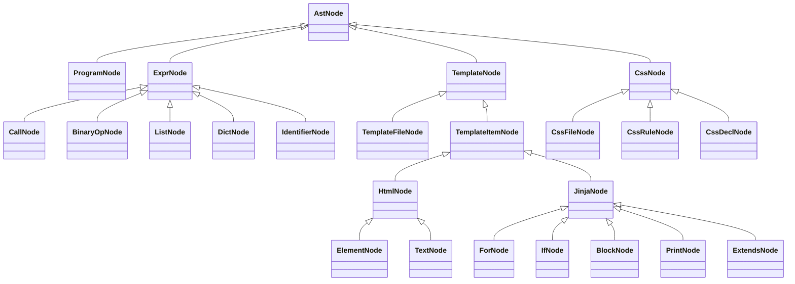

# تقرير مشروع المترجمات

## معلومات عامة

اسم المشروع: Flask-Jinja2-Compiler  
الفرع المستخدم للتطوير: S2  
رابط المستودع: https://github.com/AliAsaad715/Flask-Jinja2-Compiler

يهدف المشروع إلى بناء مترجم مصغر لتطبيقات Flask التي تستخدم Jinja2 مع HTML وCSS. يغطي المشروع مراحل التحليل اللفظي والنحوي، بناء AST، بناء جداول الرموز، الربط بين Python وJinja، التحليل الدلالي، وتوليد تطبيق Flask قابل للتشغيل.

## بنية المشروع

- `src/antlr`: قواعد ANTLR وملفات lexer/parser المولدة للغات Python وJinja/HTML وCSS.
- `src/AST`: عقد AST الخاصة بـ Python.
- `src/AST/template`: عقد AST الخاصة بـ Jinja وHTML.
- `src/AST/template/expr`: عقد تعابير Jinja.
- `src/AST/css`: عقد AST الخاصة بـ CSS.
- `src/Visitor`: زوار بناء AST وجمع رموز القوالب.
- `src/Symbol`: جداول الرموز وأنواع الرموز.
- `src/Analysis`: الربط والتحليل الدلالي واستخراج مصادر البيانات.
- `src/Generator`: توليد تطبيق Flask من ملفات الاختبار.
- `src/app/Main.java`: نقطة تشغيل المشروع.
- `Tests`: ملفات الإدخال الأساسية.
- `Tests/semantic`: ملفات اختبار أخطاء دلالية مقصودة.
- `generated/flask_app`: تطبيق Flask مولد من ملفات المشروع.

## مرحلة Lexer وParser

تم تعريف قواعد مستقلة لكل جزء من المشروع:

- Python:
  - `src/antlr/PythonLexer.g4`
  - `src/antlr/PythonParser.g4`
- Jinja2/HTML:
  - `src/antlr/TemplateLexer.g4`
  - `src/antlr/TemplateParser.g4`
- CSS:
  - `src/antlr/CssLexer.g4`
  - `src/antlr/CssParser.g4`

تدعم قواعد Python بنية مناسبة لتطبيق Flask: الاستيراد، الإسناد، القوائم، القواميس، الدوال، decorators، route definitions، if statements، return statements، النداءات، الخصائص، indexing، وبعض التعابير المنطقية والحسابية.  
تدعم قواعد Jinja/HTML عناصر HTML، attributes، `extends`, `block`, `for`, `if`, `with`, وطباعات `{{ ... }}`.  
تدعم قواعد CSS selectors وdeclarations والقيم الأساسية.

## بناء AST

يبني المشروع أكثر من شجرة AST بحسب اللغة:

- Python AST يتم بناؤه عبر `FlaskJinja2Visitor`.
- Jinja/HTML AST يتم بناؤه عبر `TemplateAstBuilder`.
- CSS AST يتم بناؤه عبر `CssAstBuilder`.

كل العقد ترث من `AstNode` أو من عقد وسيطة مثل `TemplateNode` و`CssNode`. تحتوي العقد على اسم العقدة، رقم السطر، قائمة الأبناء، وتابع طباعة مقروء. هذا يحقق مفاهيم OOP الأساسية:

- Inheritance: جميع العقد ترث من عقد أساس مشتركة.
- Polymorphism: كل عقدة تستطيع تخصيص `describe()` أو `details()`.
- Encapsulation: بعض عقد template/css تخفي بياناتها خلف getters.

## مخطط AST مبسط



## جداول الرموز

يوجد جدول رموز خاص بـ Python في `SymbolTablePython`، ويسجل:

- imports
- variables
- functions
- parameters

كما يوجد جدول رموز خاص بالقوالب عبر `TemplateSymbolCollector`، ويسجل:

- context variables القادمة من Python.
- loop variables.
- with variables.
- scopes الخاصة بـ blocks وif وfor.

## الربط بين Python وJinja

تمت إضافة مرحلة ربط عبر `PythonTemplateBinder`. تبحث هذه المرحلة عن نداءات:

```python
render_template('template.html', key=value)
```

وتبني خريطة تربط كل template بالـ route والدالة والمتغيرات المرسلة إليه. مثال:

```text
products.html -> products_list passes {products=products}
product_detail.html -> product_detail passes {product=product}
```

هذا الربط يجعل شجرة Jinja قادرة على معرفة المتغيرات القادمة من Python بدل تحليلها بمعزل عن التطبيق.

## استخراج مصادر البيانات

تستخرج `PythonDataSourceExtractor` مصادر البيانات المعرفة في Python، خصوصا القوائم التي تحتوي قواميس. في المثال الحالي:

```python
products = [
    {'id': 1, 'name': '...', 'price': 2500.00, 'image': '...', 'details': '...'}
]
```

يتم استخراج المصدر `products` كـ `list<dict>` مع الحقول:

- `id`
- `name`
- `price`
- `image`
- `details`

ثم يتم ربطه مع `products.html` عبر context variable باسم `products`.

## التحليل الدلالي

تم تنفيذ التحليل الدلالي في:

- `FlaskSemanticAnalyzer`
- `TemplateSemanticAnalyzer`
- `SemanticDiagnostic`

يعالج المشروع أكثر من 5 أخطاء دلالية، منها:

1. `DUPLICATE_ROUTE`: وجود route مكرر بنفس المسار.
2. `ROUTE_PARAM_MISSING`: وجود parameter في route غير موجود في function parameters.
3. `FUNCTION_PARAM_NOT_IN_ROUTE`: وجود function parameter غير ممرر من route.
4. `TEMPLATE_NOT_FOUND`: استدعاء `render_template` لقالب غير موجود.
5. `DUPLICATE_TEMPLATE_CONTEXT`: تمرير نفس context key أكثر من مرة.
6. `UNDEFINED_PYTHON_NAME`: استخدام اسم Python غير معرف.
7. `EXTENDS_TEMPLATE_NOT_FOUND`: قالب Jinja يرث من قالب غير موجود.
8. `UNDEFINED_TEMPLATE_NAME`: استخدام متغير Jinja غير معرف.
9. `URL_FOR_UNKNOWN_ENDPOINT`: استخدام endpoint غير موجود في `url_for`.
10. `DUPLICATE_TEMPLATE_BLOCK`: تكرار block بنفس الاسم داخل القالب.
11. `UNKNOWN_DATA_FIELD`: استخدام حقل غير موجود في مصدر بيانات Python.

توجد ملفات اختبار مقصودة في `Tests/semantic` وتنتج 12 خطأ دلاليا عند التشغيل.

## توليد الكود

تمت إضافة مولد في `FlaskCodeGenerator` يقوم بإنشاء تطبيق Flask قابل للتشغيل داخل:

```text
generated/flask_app
```

ينتج المولد:

- `app.py`
- `templates/*.html`
- `static/style.css`
- `static/uploads`
- `README_GENERATED.txt`

إذا اكتشف التحليل الدلالي أخطاء، يتخطى المشروع مرحلة توليد الكود حتى لا يتم توليد تطبيق غير صحيح.

## الواجهات والتنقل

يدعم التطبيق الواجهات المطلوبة:

- عرض المنتجات: `products.html`
- إضافة منتج: `add_product.html`
- عرض تفاصيل منتج: `product_detail.html`
- حذف منتج: route `delete_product`

توجد روابط وأزرار للتنقل بين قائمة المنتجات، صفحة التفاصيل، صفحة الإضافة، والحذف.

## الطباعة

تطبع العقد عبر `pretty()` بشكل شجري مقروء، وتظهر معلومات العقد مثل:

- أسماء HTML tags: `{tag=div}`
- أسماء blocks: `{name=content}`
- CSS selectors: `{selector=.btn}`
- CSS declarations: `{prop=color, value=green}`

كما تتم طباعة:

- Python AST
- Python symbol table
- Python data sources
- Template context bindings
- Template data flow
- Template AST
- Template symbol table
- CSS AST
- Semantic diagnostics
- Code generation output

## أوامر التشغيل

ترجمة المشروع:

```powershell
javac -cp lib\antlr-4.13.2-complete.jar -d out src\antlr\*.java src\AST\*.java src\AST\template\*.java src\AST\template\expr\*.java src\AST\css\*.java src\Symbol\*.java src\Analysis\*.java src\Generator\*.java src\Visitor\*.java src\app\*.java
```

تشغيل المثال الصحيح:

```powershell
java -cp "out;lib\antlr-4.13.2-complete.jar" app.Main
```

تشغيل اختبار الأخطاء الدلالية:

```powershell
java -cp "out;lib\antlr-4.13.2-complete.jar" app.Main Tests\semantic\bad_app_py.txt Tests\semantic\bad_products_html.txt Tests\semantic\bad_detail_html.txt
```

تشغيل التطبيق المولد:

```powershell
cd generated\flask_app
python app.py
```

## ملاحظات ختامية

يغطي المشروع المتطلبات الأساسية للمادة: lexer/parser، بناء AST، جداول الرموز، الربط بين Python وJinja، تحليل دلالي متعدد الأخطاء، توليد كود، طباعة العقد، وتجهيز اختبارات صحيحة وخاطئة.
